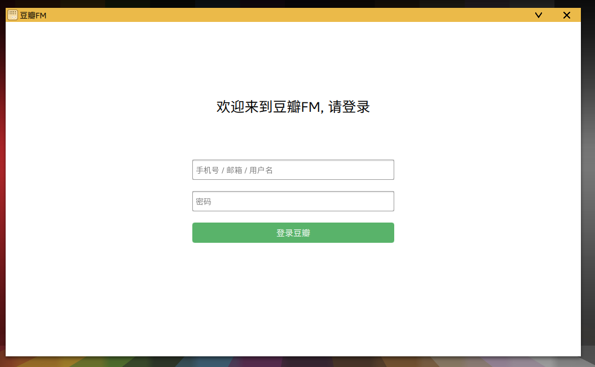
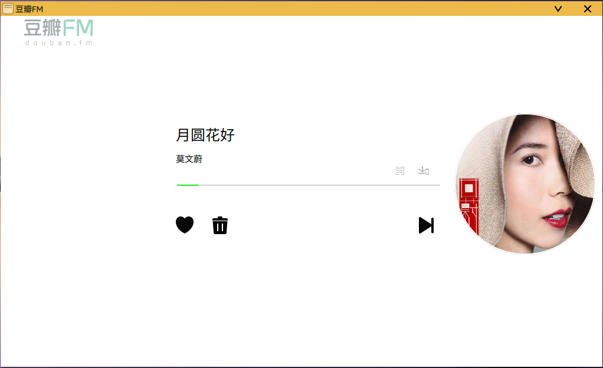

# DoubanFMonLinux

---

DoubanFMonLinux是一个将[豆瓣FM](https://douban.fm/)在线播放器搬运到Linux平台上的在线豆瓣FM第三方客户端。

## 功能

目前实现的功能有：

- 播放
- 跳过
- 加红心/取消红心
- 暂停
- 歌曲寻道
- 不再播放
- 歌曲离线到本地
- 显示歌词
- 显示歌手、歌曲以及封面信息

## 使用

### 依赖项

本项目使用了Python3、Pyqt5作为界面开发工具，请确保安装了Python3以及Pyqt5。

### 说明

本项目在Fedora 25下开发，在其他的Linux平台下应当是可以正常运行的，Windwos平台没有进行测试使用。

### 使用方式

clone此项目：

```shell
git clone https://github.com/light8lee/DoubanFMonLinux.git
```

只需简单的两步：

```shell
cd DoubanFMonLinux
python3 show.py
```

就可以使用本播放器了。

如果在使用 **python3 show.py** 命令时出现缺少import所需的package时，请安装之后重试。aineng

### 使用效果
在首次运行本播放器时，需要进行登录豆瓣FM操作，你需要一个豆瓣账号才能成功进行此操作。



成功登录之后无需再重复登录，登录后界面进入播放界面。


